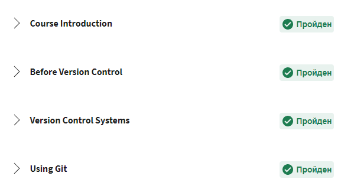
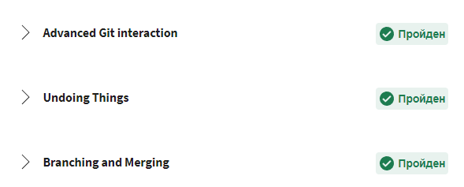

# Stage 0

## General
- [X] 1. [Git Basic](#1-git-basic)
- [ ] 2. Linux CLI and Networking
- [ ] 3. VCS, GitHub and Collaborating

## Front-End Basic
- [ ] 1. Intro to HTML & CSS
- [ ] 2. Responsive Web Design
- [ ] 3. HTML & CSS Practice
- [ ] 4. JavaScipt Basics
- [ ] 5. Document Object Model 

## Advansed Topics
- [ ] 1. Building a Tiny JS World
- [ ] 2. Object oriented JS
- [ ] 3. OOP exercise
- [ ] 4. Offline Web Applications
- [ ] 5. Memory pair game
- [ ] 6. Website Perfomance Optimization 
- [ ] 7. Friends APP

### 1. Git Basic 
###  _Coursera course_

Course in coursera is very interesting. The teacher is excellent. I hope it will help me in a future.

Coursera git 1 week
 

  

Coursera git 2 week
 

  

### _learnGitBranch_

LearnGitBranch is a good way to practise basics that we learned in coursera.
