# Stage 0

## General
- [X] 1. [Git Basic](#1-git-basic)
- [X] 2. [Linux CLI, and HTTP](#2-linux-cli-and-http)
- [X] 3. [VCS, GitHub and Collaborating](#3-git-collaboration)

## Front-End Basic
- [X] 1. [Intro to HTML & CSS](#4-intro-to-html-and-css)
- [x] 2. [Responsive Web Design](#5-responsive-web-design)
- [ ] 3. HTML & CSS Practice
- [X] 4. [JavaScipt Basics](#7-js-basics)
- [X] 5. [Document Object Model](#8-dom)

## Advansed Topics
- [ ] 1. Building a Tiny JS World
- [ ] 2. Object oriented JS
- [ ] 3. OOP exercise
- [ ] 4. Offline Web Applications
- [ ] 5. Memory pair game
- [ ] 6. Website Perfomance Optimization
- [ ] 7. Friends APP

## 1. Git Basic
###  _Coursera course_

Course in coursera is very interesting. The teacher is excellent. I hope it will help me in a future.

Coursera git 1 week

  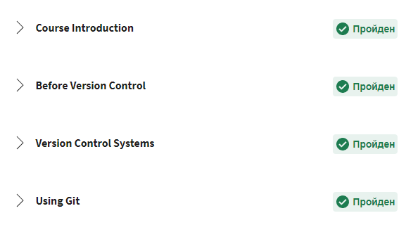

Coursera git 2 week

  

### _learnGitBranch_

LearnGitBranch is a good way to practise basics that we learned in coursera.

learnGitBranch 1

  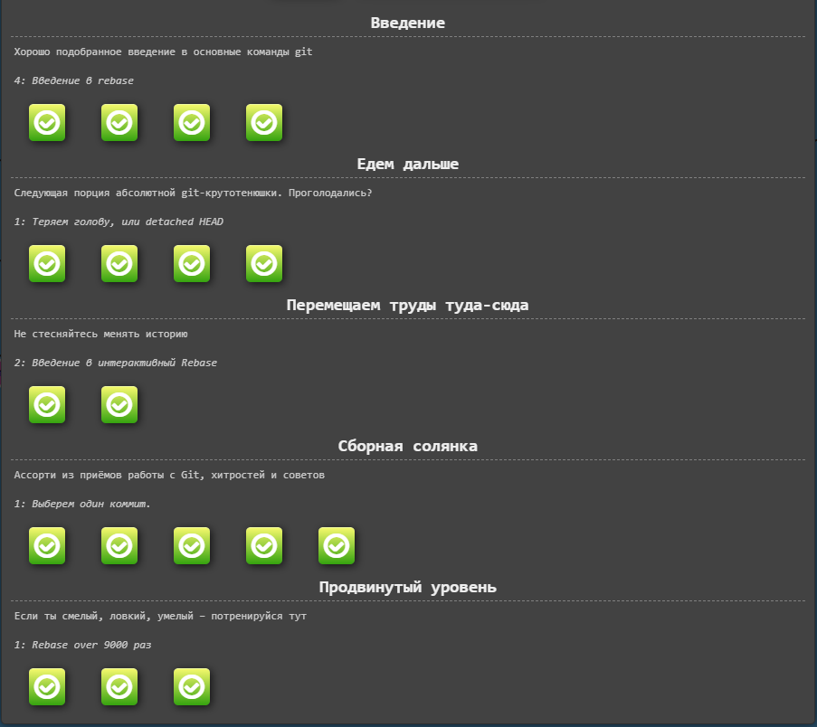

learnGitBranch 2

  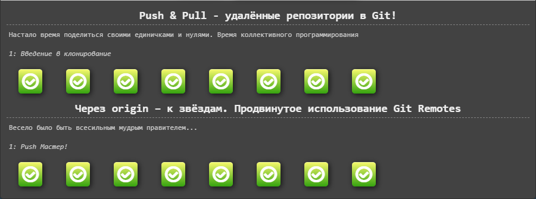

#### [Go to the top](#general)

## 2. Linux CLI, and HTTP
### _Linux Survival_

Thats was very interesting. A lot of new comands.

Linux survival Quiz 1

  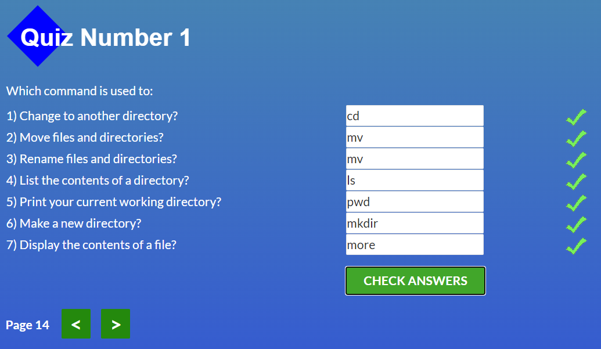

Linux survival Quiz 2

  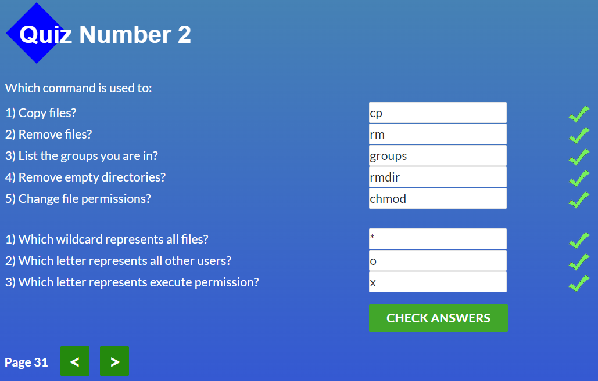

Linux survival Quiz 3

  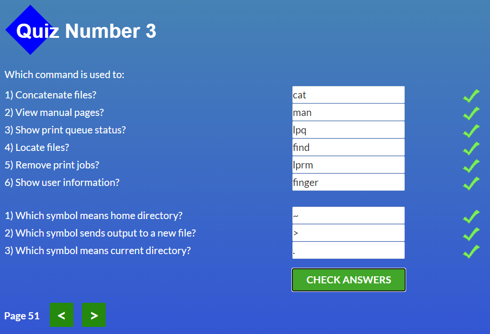

Linux survival Quiz 4

  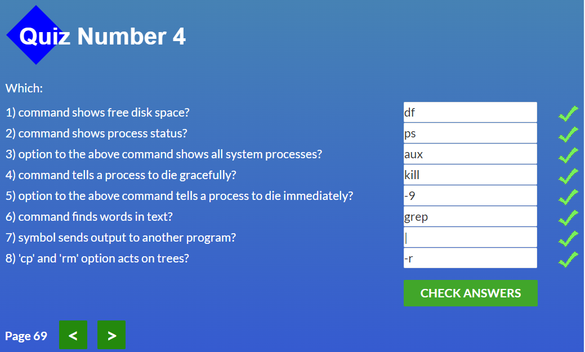

### _HTTP 1_
There are a lot of information. But i hope i will understand it on practise.
The information about status codes was interesting.
I think i will use structure of messages in future.

### _HTTP 2_
I knew basics of comunication and authorization between users and servers, but they are described more detail in this article.

#### [Go to the top](#general)

## 3. Git Collaboration
HEHE. Almost all that was at this course i made in first step.
But info about Collaboration was new and interesting.))

Coursera week 3

  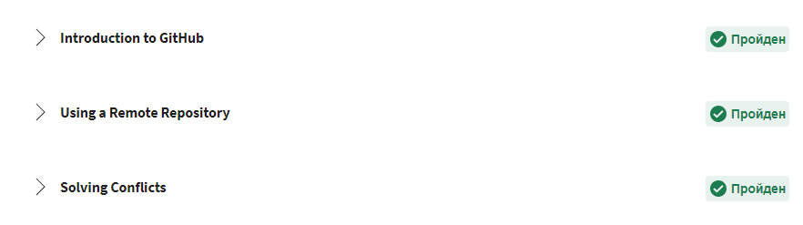

Coursera week 4

  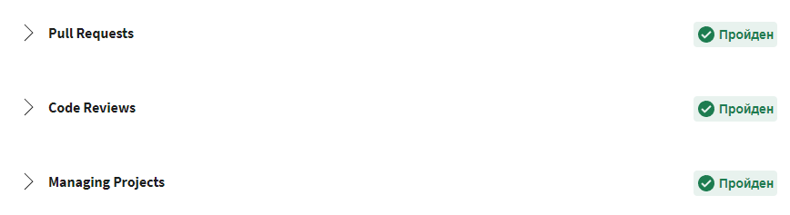

learnGitBranch 1

  

learnGitBranch 2

  

#### [Go to the top](#general)

## 4. Intro to HTML and CSS
### _Coursera_
Coursera lessons just refreshed my knowledge, because i studied this material before.

Coursera week 1

  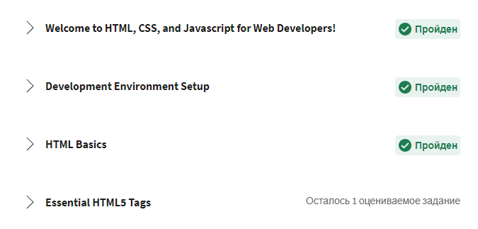

Coursera week 2

  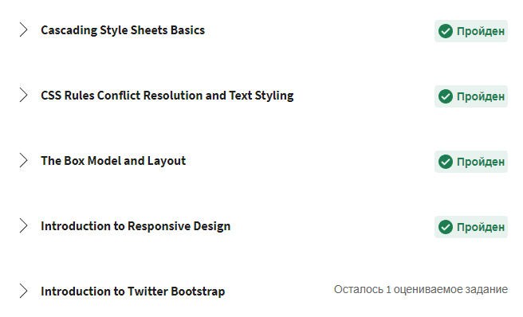

### _Learn HTML_
OMG. That's amazing way to learn new material. I refreshed knowledge about HTML and learned new features(tables and forms).

Codecademy HTML

  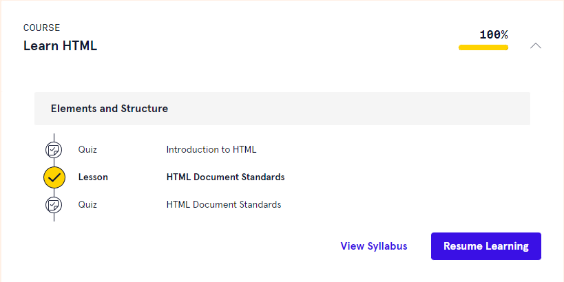

### _Learn CSS_
Info about selectors was useful. I'll use it in a future.
Info about overflow was new for me.
There are a lot of info about positioning of elements. That's a little hard for me, but i'm doing my best. I'm sure that i will understand it. Need more practice. Keep going to the status of the best developer.))

Codecademy CSS

  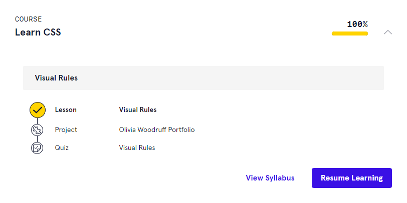

#### [Go to the top](#general)

## 5. Responsive Web Design
### _Responsive web design basics_

Learned a lot of new info about sizing content. Not all is clear. I hope i'll understand it later on practice.

### _FLEXBOX_

Learned new commands:
- display:flex
- display: inline-flex
- justufy-content
- align-items
- flex-wrap
- align-self
- order
- flex-basis
- flex-grow
- flex-shrink

### _Flexbox Froggy_

Fixed new knowledge that i learned in a previous part. Its the best way for understanding new material for me.

FlexboxFroggy

  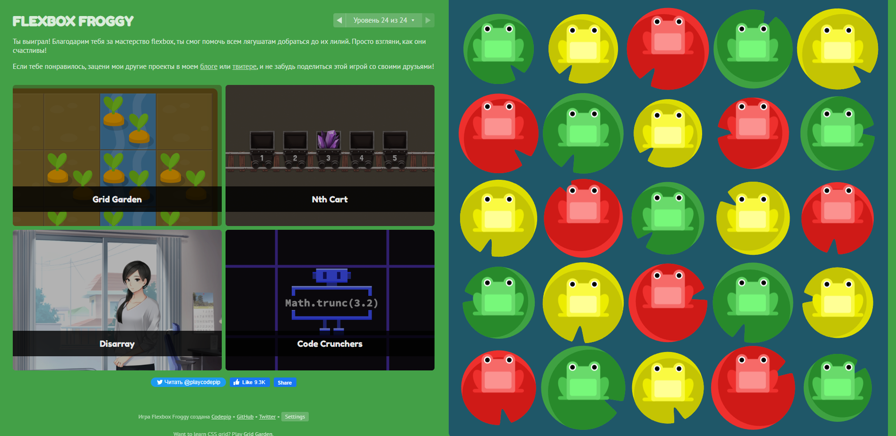    

### _CSS Grid Layout_

Learned new commands:
- grid-template-rows и grid-template-columns
- fr
- minmax
- fit-content
- grid-template-areas
- grid-template
- grid-auto-rows, grid-auto-columns
- grid-auto-flow

### _Grid Garden_

Fixed new knowledge that i learned in a previous part.

GridGarden

  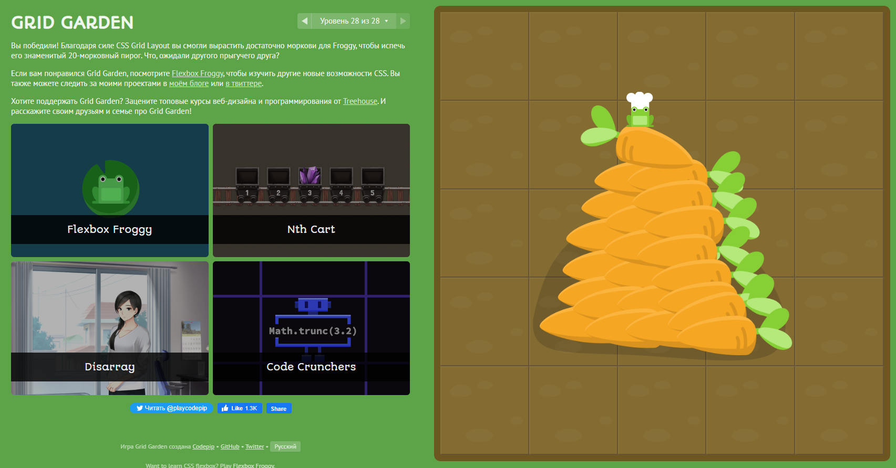

#### [Go to the top](#general)

## 7. JS Basics

JS is not hard as i thought (on this level). I learned coding at school and university so i understand basics.

Coursera

  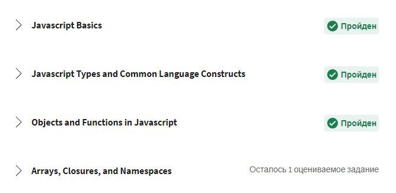

Ok, practice was hard a little at the end))

Basic JS

  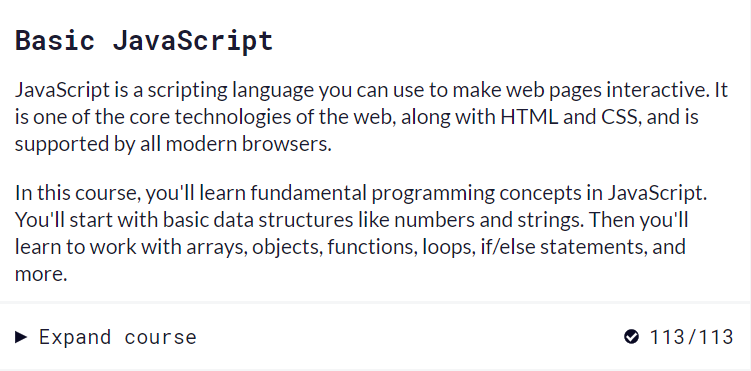

ES6 Challenges

  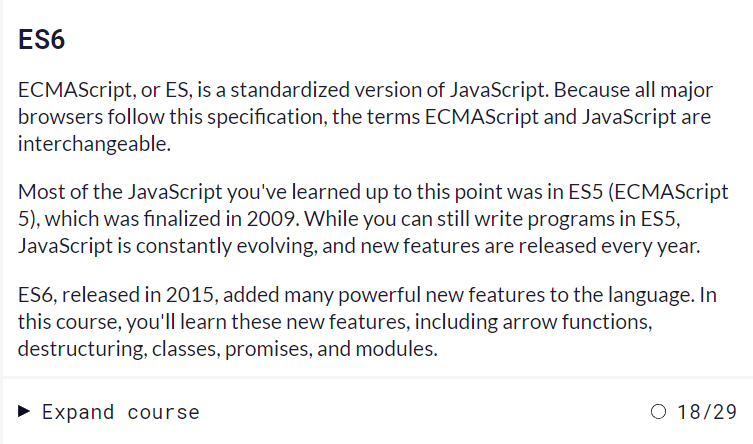

Basic Data Structures

  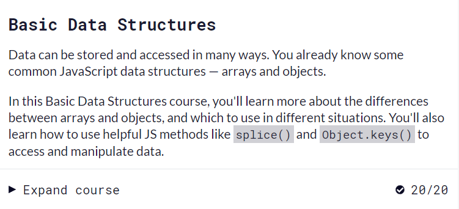

Basic Algorithm Scripting

  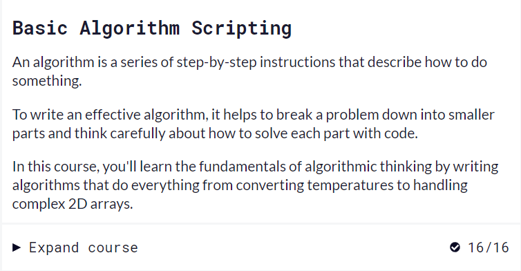

Functional Programming

  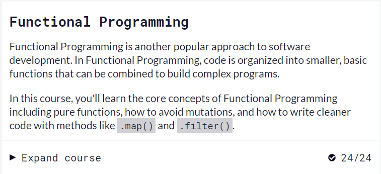

Algorithm Scripting Challenges

  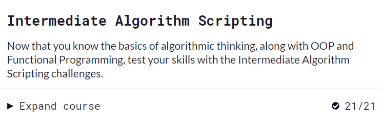

#### [Go to the top](#general)

## 8. DOM

It was interesting to listen this lecture. But... Lets do practice)))

Coursera

  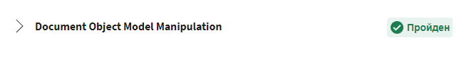

To be honest, the practice was exhausting. Sometimes confusing. Maybe I was just tired at that moment. It didn't do without hints, but I managed.

Algorithm Scripting Challenges

  

Here u can see what i did on practice.

[Pages](https://yarhadi.github.io/dom/)
[CodeBase](https://github.com/YarHadi/dom)

#### [Go to the top](#general)
